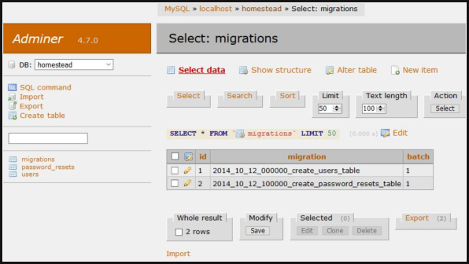

<p align="center">
<a href="https://packagist.org/packages/ferleal/laravel-adminer"></a>
<a href="https://packagist.org/packages/ferleal/laravel-adminer"></a>
<a href="https://packagist.org/packages/ferleal/laravel-adminer"></a>
</p>

# Introduction
Laravel 5.8 + wrapper for [Adminer](https://www.adminer.org).
Adminer is a fast single-file database manager/explorer tool written by Jakub Vrana. It's a great replacement for 
PhpMyAdmin (also supports PostgreSQL, SQLite, MS SQL, Oracle, Firebird, SimpleDB, Elasticsearch and MongoDB).

This package is meant to be used with Laravel as an in-built database manager/explorer. It comes with support for
Adminer [plugins](https://www.adminer.org/en/plugins/) and themes, which super-charges an already powerful tool.

This package is inspired by: [miroc/Laravel-Adminer](https://github.com/miroc/Laravel-Adminer), [senaranya /
laravel-adminer](https://github.com/senaranya/laravel-adminer)  
and
[onecentlin/laravel-adminer](https://github.com/onecentlin/laravel-adminer)


The reason to add this
 package is to keep it up-to-date with Adminer and add plugin support with SQLITE.
 
 #### Database view with default theme
 


#### Table view with 'rmsoft' theme



## Plugins Included

#### Tables-filter

Adds ability to do (fuzzy) search on table names. It's especially useful when you have a large set of tables 


## Installation
To use this package, run:
```
composer require ferleal/laravel-adminer
```
### To use Adminer to Laravel routes (e.g. /adminer), update `routes/web.php`:

To autologin Adminer with Laravel default connection:
```php
Route::any('adminer', '\Ferleal\Adminer\Http\Controllers\AdminerController@auto');
```

If you want to manually provide credentials on the UI instead:
```php
Route::any('adminer', '\Ferleal\Adminer\Http\Controllers\AdminerController@index');
```

if you want to use sqlite you can use is it like this, just watch out to leave it open I usualy only leave it for internal ip.
```php
Route::any('adminer', '\Ferleal\Adminer\Http\Controllers\AdminerController@sqlite');
```
Of course, you can add any middleware of your choice to restrict usage:
```php
Route::any('adminer', '\Ferleal\Adminer\Http\Controllers\AdminerController@auto')
    ->middleware(['admin']);
```

### Disabling CSRF Middleware
Adminer doesn't work with VerifyCsrfToken middleware, so it has to be disabled on its route.
In `VerifyCsrfToken.php` disable CSRF by adding adminer route to `$except` array:
```php
protected $except = [
    'adminer'
];
```

### To add plugins
Adminer supports a host of [plugins](https://www.adminer.org/en/plugins/). 
See [CONTRIBUTING](CONTRIBUTING.md) to add a new plugin

## Adminer Theme (Optional)

Publish theme file (You may use the default theme without executing this action)
```
php artisan vendor:publish --provider="Ferleal\Adminer\AdminerServiceProvider"
```

You may download `adminer.css` from [Adminer](https://www.adminer.org) or create custom style, and place it into `public/vendor/adminer` folder.

### Countions
Beware on leaving Adminer open on production it should used in local or behind a proxy and protected with Laravel Auth middlewares.
